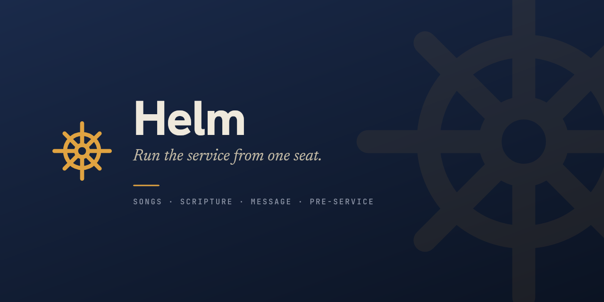

# Helm

A Mac + Windows desktop app for running a church service from one seat: congregational
songs, scripture, sermon quotes, and a rotating pre-service loop —
searched by half-remembered lyric or typed reference, cued and taken live from an operator
console, and projected full-screen to a second display over HDMI. Everything is stored
locally in SQLite; the operator window and the physical output are both pure renders of
one shared presentation state, so what you see in the preview is exactly what the room
sees. See `docs/superpowers/specs/2026-07-03-helm-design.md` §1 for the full purpose and
success criteria.

## Download (Windows)

**[Download Helm](https://github.com/chase-codes/helm/releases/latest/download/Helm-Setup.exe)** — installs per-user, no admin needed, and updates itself.

> **Note:** Until Helm's code-signing certificate is in place, Windows SmartScreen
> will show "Windows protected your PC" on first run. Click **More info → Run
> anyway**. This is expected for new unsigned apps and will go away in a future
> release.

**Status:** slice 1–2 (songs mode), slice 3 (scripture), slice 4 (the Message track), and
slice 5 (the pre-service loop) are implemented — song search, cue, go-live, quick-add, keyboard control, resizable panels,
auto-attaching output window; scripture reference parsing, bundled KJV plus an in-app Bible
installer, sermon-mode scripture track with chapter rail and translation compare; and the
Message track — William Branham sermon "tapes" with full-text offline search (tape search,
quote search, search-within-a-tape), quote slides, a tape audio player, and a scrolling
follow-along reading view. Slice 5 adds the pre-service loop — a rotating welcome / verse /
announcements / prayer / logo card set on a dwell timer, engaged and taken live from the
operator's Pre-Service tab; verse cards can pull their text from the installed Bible by
reference. Multi-display roles remain deferred to later slices (spec §11).

**Message track — acquisition & audio (spec `docs/superpowers/specs/2026-07-03-helm-slice-4-message-design.md`).**
Sermon text and audio come from Voice of God Recordings' official distribution only.
Text installs in full (small, fully searchable offline); audio (`.m4a`) is downloaded
**on demand** and cached in the app-data `library/` folder — never a bulk pre-download.
**Local import** (Settings → Message → Import) is the other authoritative path: `.txt`
and `.pdf` transcripts the church already has are parsed into tape number / title / date /
numbered paragraphs, with an operator review screen before save. Two follow-ups are
noted in `docs/superpowers/notes/2026-07-03-the-table-acquisition.md`: the live branham.org
downloader (**4a** — the source is scrape-based, so the in-app "Install corpus" button is
wired but not yet functional) and hands-free audio↔text sync for the reading view via
forced alignment (**4b** — until then the reading view renders but does not auto-scroll).

## Project setup

```bash
npm install
```

## Development

```bash
npm run dev          # launch the app (operator window + on-demand output window)
npm test              # vitest, run once
npm run test:watch    # vitest, watch mode
npm run typecheck     # tsc --noEmit for both main/preload and renderer configs
npm run lint           # eslint
```

### `better-sqlite3` and Electron's ABI

`better-sqlite3` is a native module, so its compiled binary is tied to one Node ABI.
The app runs under Electron's ABI, so **that is the only ABI the binary is ever built
for** — `npm run postinstall` (electron-builder `install-app-deps`) keeps it there, and
you should never need to rebuild it by hand.

`npm test` does **not** use `better-sqlite3`. The main-process tests open their database
through `openTestDb()` (`src/main/testDb.ts`), which is backed by Node's built-in
`node:sqlite` (no native binary, FTS5 included). So the test suite runs under plain Node
without touching the Electron-ABI binary — no rebuild dance, and a stray `npm install`
can't break the app's build. Production code (`openDb` in `src/main/db.ts`) still uses
`better-sqlite3`; only the tests are decoupled from it.

If `better-sqlite3` ever throws a "was compiled against a different Node.js version"
error when launching the app, its binary got rebuilt for plain Node (usually by an
`npm install`) — run `npx electron-rebuild -f -w better-sqlite3` (or `npm run postinstall`)
to put it back on Electron's ABI.

## Build / package (smoke only — see spec §11, cross-platform installers are a later slice)

```bash
npm run build && npx electron-builder --dir   # unpacked app in dist/
```

## Architecture

- **Spec:** `docs/superpowers/specs/2026-07-03-helm-design.md` — purpose, success
  criteria, process layout, presentation-state model, data model.
- **Plan / build log:** `.superpowers/sdd/` — per-task briefs and reports for how the
  spec was implemented, plus `progress.md` for a one-line-per-task summary of what
  shipped and what was deferred.
- **Design source:** `docs/design/` — the vendored prototype (`Lectern.pretty.html`,
  `Lectern.dc.html`, `SlideCanvas.dc.html`) that the operator UI and output rendering
  are ported from pixel-for-pixel.
- **Bugs & backlog:** [GitHub Issues](https://github.com/chase-codes/helm/issues) —
  bugs carry the `bug` label plus a severity (`sev-1`…`sev-4`) and an `area:*` label;
  feature ideas carry `enhancement` plus an `area:*` label. Pre-migration history
  (fixed bugs, shipped roadmap items) stays in `docs/superpowers/bugs.md` and
  `docs/superpowers/roadmap.md`.
- **Brand assets:** `assets/` — the helm-wheel mark (`helm-mark.svg`, `helm-mark-ink.svg`),
  app icon (`app-icon/`, 16/32/48 px are hand-tuned and never regenerated), the UI icon
  set (`icons/`, `currentColor` SVGs), and the GitHub banner. Rasters, `build/icon.*`,
  and `resources/icon.png` are regenerated from the vectors with
  `node scripts/generate-brand-assets.mjs`.

In brief: the **main process** owns the SQLite database and the single source of truth
for presentation state (what's cued, what's live) behind typed IPC. The **operator
window** is the console — search, cue, go-live. **Output windows** are frameless,
per-display renders of that same state; they hold no local state of their own.

## Sunday quickstart

1. Plug in the projector — before or after launching Helm, doesn't matter. The output
   window attaches to it automatically.
2. Launch Helm (`npm run dev`, or the packaged app).
3. Songs tab → type a few words of the lyric → **Enter** to cue → **Go live** (or press
   Enter/Space again) to put it on screen.
4. Sermon tab → type a reference — `john 3:16` — and press **Enter** to put it on screen
   immediately. Settings → Bibles has KJV installed out of the box; install more
   translations there (needs a network connection) to compare versions side by side.
5. Message tab → search a tape (or a quote by phrase), pick a paragraph, **Go live** to
   put the quote on screen. To play a tape, press ▶ on the player card (audio downloads
   and caches on first play). Load tapes ahead of time via Settings → Message → Import
   (`.txt`/`.pdf`) — review the parsed paragraphs, then save.
